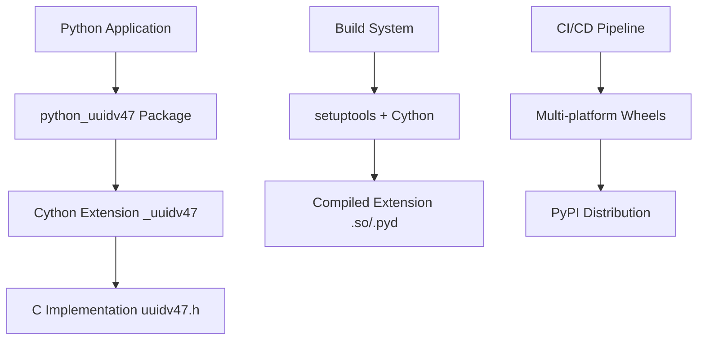

# Design Document

## Overview

The `python-uuidv47` package is a high-performance Python library that provides UUIDv47 operations through a Cython extension wrapping a C implementation. The design prioritizes performance, cross-platform compatibility, and ease of use while maintaining identical behavior to the existing Node.js implementation.

The package enables encoding UUIDv7 strings into UUIDv4 facades and decoding them back using cryptographic keys, providing a way to obfuscate temporal information in UUIDs while maintaining format compatibility.

## Architecture

### High-Level Architecture



### Component Architecture

The system consists of three main layers:

1. **Python API Layer**: Clean, Pythonic interface with type hints
2. **Cython Extension Layer**: High-performance bridge to C implementation
3. **C Implementation Layer**: Core cryptographic operations

### Key Design Decisions

1. **Shared C Implementation**: Uses the same `uuidv47.h` header as the Node.js version to ensure identical behavior
2. **Global State Management**: Maintains encryption keys in global state for performance, matching Node.js API design
3. **Cython for Performance**: Leverages Cython's `nogil` capabilities for true parallel execution
4. **Modern Python Packaging**: Uses `pyproject.toml` and automated wheel building for easy distribution

## Components and Interfaces

### 1. Python Package Interface (`python_uuidv47/__init__.py`)

**Purpose**: Provides the public API with proper type hints and documentation.

**Key Functions**:
- `set_keys(k0: int, k1: int) -> bool`: Set global encryption keys
- `encode(uuid_str: str) -> str`: Encode UUIDv7 to UUIDv4 facade
- `decode(facade_str: str) -> str`: Decode facade back to UUIDv7
- `has_keys() -> bool`: Check if keys are set
- `uuid_parse(uuid_str: str) -> bool`: Validate UUID format

**Interface Design**:
```python
# Type-safe interface with runtime validation
def set_keys(k0: int, k1: int) -> bool:
    """Set global encryption keys for encoding/decoding operations."""
    
def encode(uuid_str: str) -> str:
    """Encode a UUIDv7 into a UUIDv4 facade using global keys."""
    
def decode(facade_str: str) -> str:
    """Decode a UUIDv4 facade back to original UUIDv7 using global keys."""
```

### 2. Cython Extension (`python_uuidv47/_uuidv47.pyx`)

**Purpose**: High-performance bridge between Python and C implementation.

**Key Features**:
- `nogil` operations for parallel execution
- Direct C struct manipulation for zero-copy operations
- Efficient string handling with minimal allocations
- Global state management matching Node.js behavior

**C Interface Declarations**:
```cython
cdef extern from "uuidv47.h":
    ctypedef struct uuid128_t:
        uint8_t b[16]
    
    ctypedef struct uuidv47_key_t:
        uint64_t k0, k1
    
    uuid128_t uuidv47_encode_v4facade(uuid128_t v7, uuidv47_key_t key) nogil
    uuid128_t uuidv47_decode_v4facade(uuid128_t facade, uuidv47_key_t key) nogil
    bool uuid_parse(const char* s, uuid128_t* out) nogil
    void uuid_format(const uuid128_t* u, char out[37]) nogil
```

**Performance Optimizations**:
- Compiler directives: `boundscheck=False`, `wraparound=False`, `cdivision=True`
- Stack-allocated buffers for string operations
- Minimal Python object creation in hot paths

### 3. C Implementation Layer (`src/uuidv47.h`)

**Purpose**: Core cryptographic operations downloaded from upstream repository.

**Key Operations**:
- UUID parsing and formatting
- UUIDv7 to UUIDv4 facade encoding
- UUIDv4 facade to UUIDv7 decoding
- Cryptographic transformations using provided keys

**Integration Strategy**:
- Downloaded during build process to ensure latest version
- Compatibility verification through C test compilation
- Platform-specific compiler optimizations

### 4. Build System

**Purpose**: Automated building, testing, and distribution across platforms.

**Components**:

#### Modern Python Packaging (`pyproject.toml`)
```toml
[build-system]
requires = ["setuptools>=64", "wheel", "Cython>=0.29.32", "requests"]
build-backend = "setuptools.build_meta"

[project]
name = "python-uuidv47"
requires-python = ">=3.8"
dependencies = []
```

#### Custom Build Logic (`setup.py`)
- Automatic header download from upstream repository
- C compatibility verification
- Platform-specific compiler optimizations
- Cython compilation with performance directives

#### CI/CD Pipeline
- Multi-platform testing (Windows, macOS, Linux)
- Multi-version Python support (3.8-3.12)
- Automated wheel building with `cibuildwheel`
- PyPI publishing on release

## Data Models

### 1. UUID Data Structures

**C Level**:
```c
typedef struct {
    uint8_t b[16];  // 128-bit UUID as byte array
} uuid128_t;

typedef struct {
    uint64_t k0, k1;  // 128-bit encryption key as two 64-bit integers
} uuidv47_key_t;
```

**Python Level**:
- UUIDs represented as standard 36-character strings (e.g., "550e8400-e29b-41d4-a716-446655440000")
- Keys represented as Python integers (up to 64-bit unsigned)

### 2. Global State Management

**State Variables**:
```cython
cdef uuidv47_key_t _global_key = uuidv47_key_t(k0=0, k1=0)
cdef bool _key_set = False
```

**State Transitions**:
1. Initial state: `_key_set = False`
2. After `set_keys()`: `_key_set = True`, keys stored in `_global_key`
3. Operations require `_key_set = True` or raise `RuntimeError`

### 3. String Processing Pipeline

**Encoding Flow**:
1. Python string → ASCII bytes → C string
2. C string → `uuid128_t` struct (via `uuid_parse`)
3. `uuid128_t` + keys → encoded `uuid128_t` (via `uuidv47_encode_v4facade`)
4. Encoded `uuid128_t` → C string → Python string

**Decoding Flow**:
1. Python string → ASCII bytes → C string
2. C string → `uuid128_t` struct (via `uuid_parse`)
3. `uuid128_t` + keys → decoded `uuid128_t` (via `uuidv47_decode_v4facade`)
4. Decoded `uuid128_t` → C string → Python string

## Error Handling

### 1. Error Categories

**Runtime Errors**:
- `RuntimeError`: Keys not set when attempting encode/decode operations
- `OverflowError`: Key values exceed 64-bit unsigned integer range

**Validation Errors**:
- `ValueError`: Invalid UUID format in input strings
- `TypeError`: Incorrect parameter types (handled by Cython)

### 2. Error Handling Strategy

**Defensive Programming**:
- All public functions validate inputs before processing
- C operations wrapped in error checking
- Clear, descriptive error messages

**Error Propagation**:
```cython
# Example error handling pattern
with nogil:
    if not uuid_parse(uuid_cstr, &v7):
        with gil:
            raise ValueError("Invalid UUIDv7 format")
```

**State Consistency**:
- Errors do not corrupt global state
- Failed operations leave system in consistent state
- No partial updates or memory leaks

### 3. Cross-Language Compatibility

**Error Consistency**:
- Error conditions match Node.js implementation behavior
- Same validation rules and error messages
- Identical handling of edge cases

## Testing Strategy

### 1. Unit Testing

**Test Categories**:
- **Functional Tests**: Core encode/decode operations
- **Error Handling Tests**: Invalid inputs and edge cases
- **State Management Tests**: Key setting and validation
- **Compatibility Tests**: Cross-language result verification

**Test Framework**: pytest with comprehensive fixtures

**Example Test Structure**:
```python
class TestUUIDv47:
    def setup_method(self):
        set_keys(0, 0)  # Reset to known state
    
    def test_encode_decode_roundtrip(self):
        set_keys(123456789, 987654321)
        original = str(uuid4())
        facade = encode(original)
        decoded = decode(facade)
        assert decoded == original
```

### 2. Performance Testing

**Benchmarking Strategy**:
- `pytest-benchmark` for consistent measurements
- Single operation benchmarks (encode/decode)
- Batch operation benchmarks (1000+ operations)
- Memory usage profiling

**Performance Targets**:
- Minimum 100,000 operations per second
- Sub-microsecond per-operation latency
- Minimal memory allocation overhead

### 3. Compatibility Testing

**Cross-Language Verification**:
- Shared test vectors between Python and Node.js implementations
- Automated compatibility verification during build
- C test program compilation and execution

**Platform Testing**:
- Windows, macOS, Linux support
- Python 3.8-3.12 compatibility
- 32-bit and 64-bit architecture support

### 4. Integration Testing

**Build System Testing**:
- Header download and verification
- Compilation across platforms
- Wheel building and installation
- Import and basic functionality verification

**CI/CD Testing**:
- Automated testing on multiple platforms
- Performance regression detection
- Type checking with mypy
- Code quality with black, isort, flake8

## Performance Considerations

### 1. Optimization Strategies

**Cython Optimizations**:
- `nogil` blocks for parallel execution
- Disabled bounds checking and wraparound
- C division for integer operations
- Stack allocation for temporary buffers

**Compiler Optimizations**:
- `-O3` optimization level
- `-march=native` for CPU-specific optimizations
- `-ffast-math` for floating-point operations
- Platform-specific flags (MSVC on Windows)

### 2. Memory Management

**Allocation Strategy**:
- Stack allocation for small, fixed-size buffers
- Minimal Python object creation in hot paths
- Efficient string encoding/decoding
- No dynamic memory allocation in C layer

**Memory Safety**:
- Bounds checking in debug builds
- Proper cleanup of temporary objects
- No memory leaks in error paths

### 3. Scalability

**Parallel Execution**:
- `nogil` operations allow true parallelism
- Thread-safe global state access
- No GIL contention in core operations

**Batch Processing**:
- Efficient handling of multiple operations
- Minimal per-operation overhead
- Optimized for high-throughput scenarios

## Security Considerations

### 1. Cryptographic Security

**Key Management**:
- Keys stored in process memory only
- No key persistence or logging
- Secure key comparison operations

**Algorithm Security**:
- Uses proven cryptographic primitives from C implementation
- No custom cryptographic code
- Regular updates from upstream repository

### 2. Input Validation

**String Validation**:
- Strict UUID format validation
- ASCII encoding enforcement
- Buffer overflow prevention

**Parameter Validation**:
- Type checking at Python/Cython boundary
- Range validation for key values
- Null pointer checks in C operations

### 3. Side-Channel Resistance

**Timing Attacks**:
- Constant-time operations where possible
- No data-dependent branching in hot paths
- Consistent error handling timing

## Deployment and Distribution

### 1. Package Distribution

**Wheel Strategy**:
- Pre-built wheels for major platforms
- Source distribution for custom builds
- Automated building with `cibuildwheel`

**Platform Support**:
- Windows: x64 wheels
- macOS: Universal2 wheels (Intel + Apple Silicon)
- Linux: manylinux wheels for broad compatibility

### 2. Version Management

**Semantic Versioning**:
- Major: Breaking API changes
- Minor: New features, backward compatible
- Patch: Bug fixes, performance improvements

**Compatibility Matrix**:
- Python 3.8+ support
- Cython 0.29.32+ requirement
- C11 compiler requirement

### 3. Documentation and Support

**Documentation Strategy**:
- Comprehensive README with examples
- API documentation with type hints
- Performance benchmarks and comparisons
- Migration guide from other UUID libraries

**Type Safety**:
- Complete type stubs (`.pyi` files)
- `py.typed` marker for mypy compatibility
- Runtime type checking where appropriate